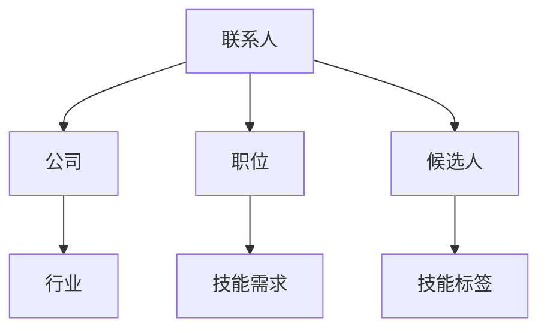
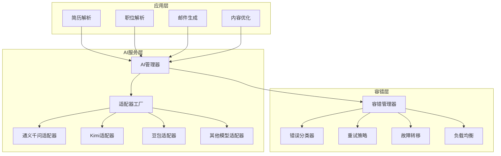
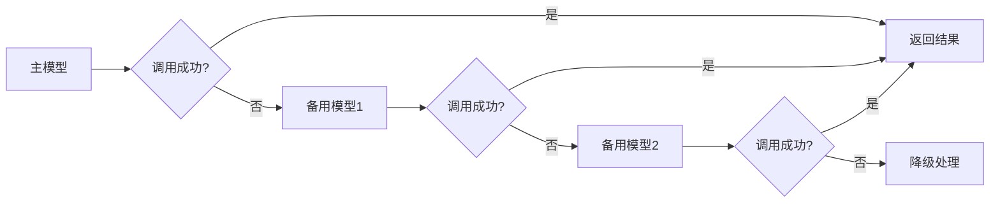
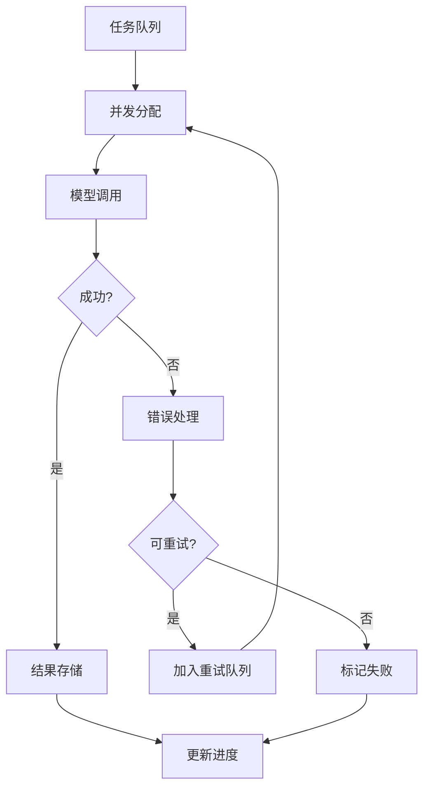
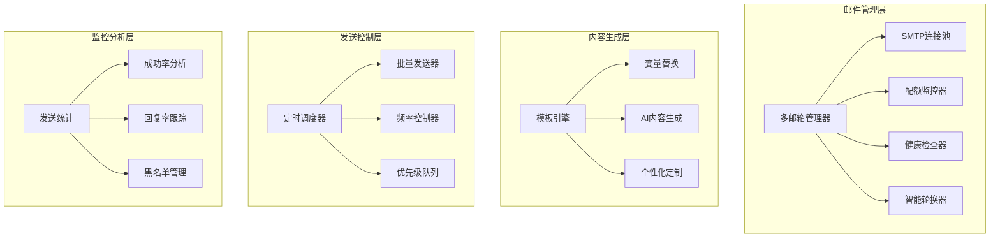
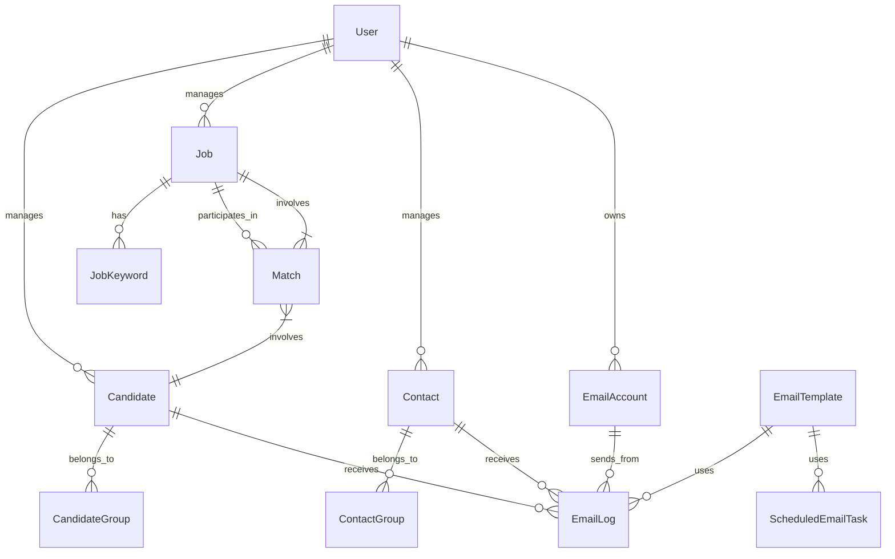

# 🏗️ 智能猎头招聘管理系统 - 架构与功能详解

## 📋 目录
- [系统概述](#系统概述)
- [核心功能模块](#核心功能模块)
- [技术架构](#技术架构)
- [AI智能引擎](#ai智能引擎)
- [邮件营销系统](#邮件营销系统)
- [数据模型设计](#数据模型设计)
- [性能优化](#性能优化)

## 🎯 系统概述

智能猎头招聘管理系统是一个基于Django的现代化招聘管理平台，集成了先进的AI技术和完善的邮件营销功能，为猎头公司提供从职位发布到候选人匹配、从邮件营销到客户关系管理的全流程解决方案。

### 🌟 核心价值
- **智能化**: AI驱动的简历解析、职位匹配和邮件生成
- **自动化**: 批量处理、定时任务和智能邮件轮换
- **个性化**: 基于用户行为的个性化推荐和邮件内容
- **规模化**: 支持大批量数据处理和高并发访问

## 🧩 核心功能模块

### 1. 👥 候选人管理系统

#### 🔍 智能简历解析


**功能特性**:
- 支持PDF、Word、TXT等多种格式
- AI自动提取个人信息、工作经历、技能标签
- 智能识别联系方式、教育背景、项目经验
- 自动生成候选人技能画像和职位匹配标签

#### 👥 分组管理
- **动态分组**: 基于技能、经验、地点等维度自动分组
- **手动分组**: 支持自定义分组规则和批量操作
- **标签体系**: 多层级标签管理，支持标签继承和关联

### 2. 💼 职位管理系统

#### 📝 智能职位解析


**解析能力**:
- 职位标题、公司信息、薪资范围
- 技能要求、工作地点、福利待遇
- 工作职责、任职要求、加分项
- 行业分类、职位级别、紧急程度

#### 🎯 关键词体系
- **技能关键词**: 编程语言、框架、工具等
- **行业关键词**: 互联网、金融、教育等
- **职级关键词**: 初级、中级、高级、专家
- **地域关键词**: 城市、区域、远程工作

### 3. 🏢 联系人关系管理

#### 👔 企业联系人
- **联系人档案**: 姓名、职位、联系方式、决策权重
- **公司信息**: 规模、行业、文化、招聘需求
- **互动历史**: 邮件往来、电话记录、会面安排
- **关系维护**: 定期跟进、节日问候、资讯分享

#### 🔗 关系网络


### 4. 🎯 智能匹配引擎

#### 🧮 多维度匹配算法
```python
匹配得分 = (技能匹配度 × 0.4) + 
          (经验匹配度 × 0.25) + 
          (地点匹配度 × 0.15) + 
          (薪资匹配度 × 0.1) + 
          (教育背景 × 0.05) + 
          (其他因素 × 0.05)
```

**匹配维度**:
- **技能匹配**: 核心技能、相关技能、学习能力
- **经验匹配**: 工作年限、项目经验、行业背景
- **地理匹配**: 工作地点、通勤距离、远程意愿
- **薪资匹配**: 期望薪资、当前薪资、涨幅合理性

#### 📊 匹配结果展示
- **评分可视化**: 雷达图、条形图、趋势图
- **详细分析**: 各维度得分、加分项、减分项
- **推荐理由**: AI生成的匹配理由和建议
- **历史对比**: 与历史匹配结果的对比分析

## 🤖 AI智能引擎

### 🏗️ AI架构设计



### 🔧 适配器模式实现

每个AI模型都有独立的适配器，实现统一的接口：

```python
class BaseAIAdapter:
    def call_api(self, messages, **kwargs):
        """统一的API调用接口"""
        pass
    
    def format_request(self, messages):
        """格式化请求数据"""
        pass
    
    def parse_response(self, response):
        """解析响应数据"""
        pass
```

### 🛡️ 智能容错机制

#### 错误分类与处理
1. **网络错误**: 自动重试，指数退避
2. **API限制**: 切换备用模型
3. **配额用完**: 降级到免费模型
4. **服务不可用**: 启用缓存结果

#### 故障转移策略


### 📦 批处理引擎

#### 大数据处理能力
- **并发控制**: 智能控制并发请求数，避免API限制
- **断点续传**: 处理中断后自动恢复
- **进度跟踪**: 实时显示处理进度和统计信息
- **错误恢复**: 自动重试失败的任务

#### 处理流程


## 📧 邮件营销系统

### 🏗️ 邮件系统架构



### 📮 多邮箱智能管理

#### 邮箱轮换策略
1. **负载均衡**: 根据邮箱性能和历史成功率分配
2. **配额优先**: 优先使用剩余配额多的邮箱
3. **时间分散**: 在不同时间段使用不同邮箱
4. **域名分散**: 避免同一域名集中发送

#### 健康监控
```python
邮箱健康度 = (连接成功率 × 0.3) + 
            (发送成功率 × 0.4) + 
            (回复率 × 0.2) + 
            (投诉率 × -0.1)
```

### 🎨 AI邮件内容生成

#### 个性化生成流程


#### 内容优化策略
- **标题优化**: AI生成吸引眼球的邮件标题
- **语调调整**: 根据收件人类型调整正式/亲切语调
- **长度控制**: 自动调整邮件长度，提高阅读率
- **关键词插入**: 智能插入职位和技能关键词

### ⏰ 定时任务调度

#### 调度器功能
- **灵活调度**: 支持一次性、周期性、条件触发
- **智能分批**: 大批量邮件自动分批发送
- **时间优化**: 根据收件人时区和活跃时间安排发送
- **冲突避免**: 避免同时向同一联系人发送多封邮件

## 💾 数据模型设计

### 📊 核心数据模型



### 🗂️ 关键数据表

#### 候选人表 (Candidate)
```sql
- id: 主键
- user_id: 所属用户
- name: 姓名
- email: 邮箱
- phone: 电话
- current_position: 当前职位
- experience_years: 工作年限
- skills: 技能标签 (JSON)
- resume_file: 简历文件
- ai_parsed_data: AI解析数据 (JSON)
- predicted_job_tags: AI预测职位标签 (JSON)
- created_at: 创建时间
- updated_at: 更新时间
```

#### 职位表 (Job)
```sql
- id: 主键
- user_id: 所属用户
- title: 职位标题
- company_name: 公司名称
- description: 职位描述
- requirements: 任职要求
- salary_range: 薪资范围
- location: 工作地点
- keywords: 关键词 (JSON)
- priority: 优先级
- status: 状态 (active/inactive/filled)
- created_at: 创建时间
- updated_at: 更新时间
```

#### 匹配记录表 (Match)
```sql
- id: 主键
- candidate_id: 候选人ID
- job_id: 职位ID
- match_score: 匹配得分
- skill_score: 技能匹配分
- experience_score: 经验匹配分
- location_score: 地点匹配分
- salary_score: 薪资匹配分
- ai_analysis: AI分析结果 (JSON)
- status: 状态 (pending/contacted/interviewed/hired/rejected)
- created_at: 创建时间
```

### 🔐 数据安全设计

#### 敏感信息加密
- **API密钥**: 使用Fernet对称加密存储
- **邮箱密码**: 加密存储，支持密钥轮换
- **个人信息**: 敏感字段加密，支持数据脱敏

#### 访问控制
- **用户隔离**: 严格的多租户数据隔离
- **权限控制**: 基于角色的访问控制 (RBAC)
- **操作日志**: 完整的操作审计日志

## ⚡ 性能优化

### 🚀 查询优化

#### 数据库优化策略
```python
# 使用select_related优化外键查询
candidates = Candidate.objects.select_related('user').all()

# 使用prefetch_related优化多对多查询
jobs = Job.objects.prefetch_related('keywords').all()

# 使用索引优化查询
class Candidate(models.Model):
    email = models.EmailField(db_index=True)  # 为常用查询字段添加索引
    created_at = models.DateTimeField(auto_now_add=True, db_index=True)
```

#### 缓存策略
```python
from django.core.cache import cache

def get_candidate_matches(candidate_id):
    cache_key = f'candidate_matches_{candidate_id}'
    matches = cache.get(cache_key)
    if matches is None:
        matches = calculate_matches(candidate_id)
        cache.set(cache_key, matches, 3600)  # 缓存1小时
    return matches
```

### 📊 批处理优化

#### 批量操作
```python
# 批量创建，减少数据库往返
candidates = [
    Candidate(name=f'候选人{i}', email=f'user{i}@example.com')
    for i in range(1000)
]
Candidate.objects.bulk_create(candidates, batch_size=100)

# 批量更新
Candidate.objects.filter(status='pending').update(status='processed')
```

#### 异步处理
```python
# 使用异步任务处理耗时操作
from celery import shared_task

@shared_task
def process_bulk_emails(email_list):
    """异步处理批量邮件发送"""
    for email_data in email_list:
        send_email(email_data)
```

### 🔄 前端优化

#### HTMX无刷新交互
```html
<!-- 无刷新提交表单 -->
<form hx-post="/candidates/add/" hx-target="#candidate-list">
    <input type="text" name="name" placeholder="候选人姓名">
    <button type="submit">添加候选人</button>
</form>

<!-- 动态加载内容 -->
<div hx-get="/jobs/search/" hx-trigger="input changed delay:500ms" hx-target="#search-results">
    <input type="text" name="query" placeholder="搜索职位">
</div>
```

#### 静态资源优化
- **文件压缩**: CSS/JS文件压缩和合并
- **图片优化**: WebP格式，懒加载
- **CDN加速**: 静态资源CDN分发
- **浏览器缓存**: 合理设置缓存策略

### 📈 监控与分析

#### 性能监控
```python
import time
from functools import wraps

def monitor_performance(func):
    @wraps(func)
    def wrapper(*args, **kwargs):
        start_time = time.time()
        result = func(*args, **kwargs)
        end_time = time.time()
        
        # 记录执行时间
        logger.info(f'{func.__name__} 执行时间: {end_time - start_time:.2f}秒')
        return result
    return wrapper
```

#### 业务指标监控
- **AI调用统计**: 成功率、响应时间、错误分布
- **邮件发送统计**: 发送量、成功率、回复率
- **用户行为分析**: 活跃度、功能使用率、满意度
- **系统资源监控**: CPU、内存、数据库连接数

---

## 🎯 总结

智能猎头招聘管理系统通过现代化的技术架构和智能化的业务流程，为猎头公司提供了一个完整、高效、智能的招聘管理解决方案。系统的核心优势在于：

1. **智能化程度高**: AI驱动的各个业务环节
2. **架构设计先进**: 模块化、可扩展、高可用
3. **用户体验优秀**: 响应式设计、无刷新交互
4. **功能覆盖完整**: 从候选人管理到邮件营销的全流程
5. **性能优化充分**: 数据库优化、缓存策略、异步处理

这个系统不仅能够满足当前的业务需求，还具备良好的扩展性，能够适应未来业务的发展和技术的演进。